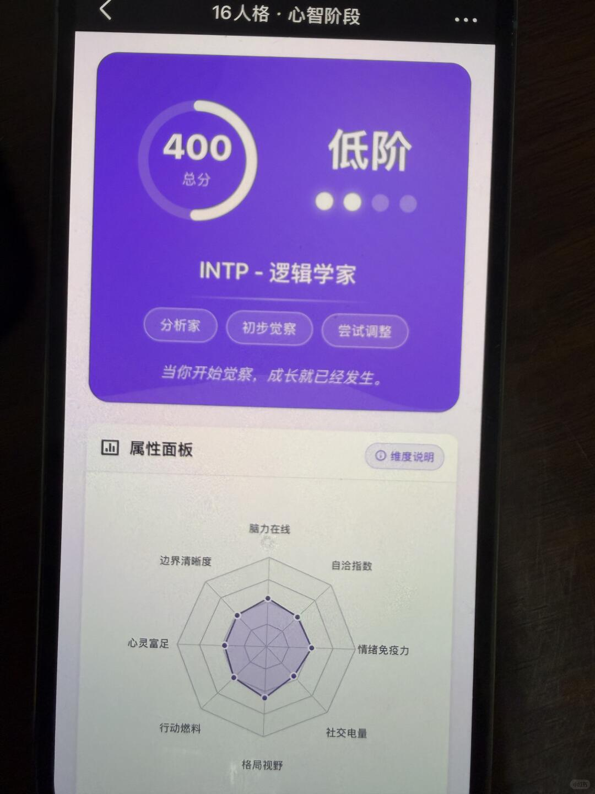
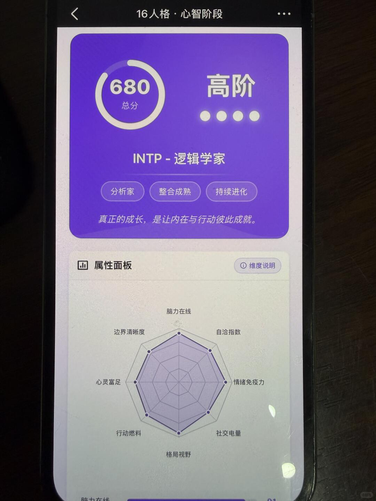

# 低阶INTP和高阶INTP的差距，真的不是一点点.


低阶：脑子永远转个不停，但99%的想法只停在脑子里。总觉得"还没想清楚"就迟迟不开始，一拖就是几个月。和人交流容易鸡同鸭讲，不是不想连接，是不知道怎么让别人懂自己在说什么，久了就懒得解释了。
	
中阶：开始能输出了，偶尔也会把脑子里的东西说出来。但还是容易陷进去，一个问题能分析出十七个维度，反而更不知道怎么行动。社交能应付，但心里清楚那是在表演，遇到真正感兴趣的人又不知道怎么靠近。
	
高阶：终于把那套庞大的思维系统变成了真正值钱的东西。不再觉得"想太多"是毛病，反而知道怎么在别人看不见的角落找到答案。行动力有了，不是变成了执行机器，而是找到了什么值得想、什么直接动手的节奏。
	
我以前总觉得自己太慢、太绕，测完阶位分析才发现，我不是没能力，只是一直在用错误的方式消耗自己。看清楚自己卡在哪，比一直觉得"我就是这样"有用太多了。
	
建议同款药水姐们也去定位一下自己，不是让你变快，是让你知道往哪儿使劲。

```
#十六人格##intp# #高阶intp# #个人性格探索# #MBTI#
```




